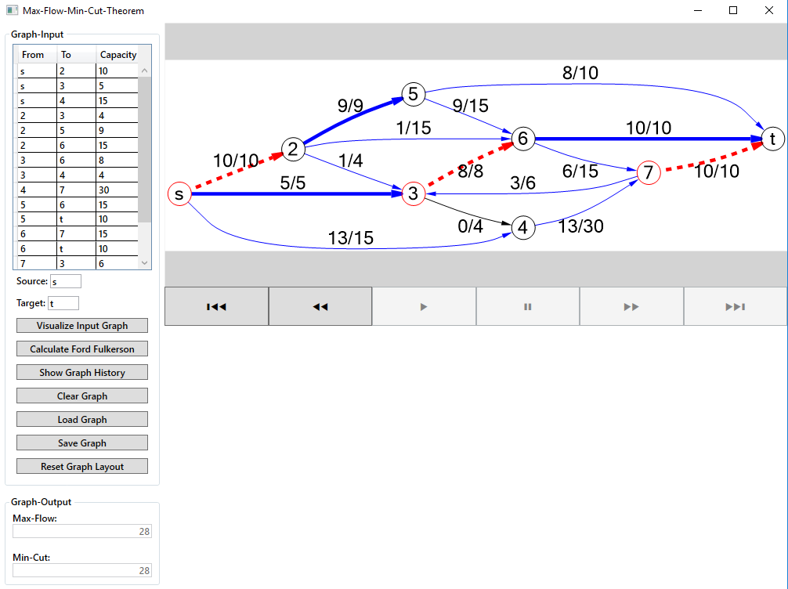

# MaxFlowMinCut
Minimum cut / maximum flow

Algorithm to calculate the minimal cut
and maximum flow of a network. Use to
Graphical visualization of the algorithm a suitable framework

For more info see [Ford-Fulkerson algorithm](https://en.wikipedia.org/wiki/Ford%E2%80%93Fulkerson_algorithm) on Wikipedia

### UI Example

### German Intro

Minimaler Schnitt / Maximaler Fluss

Entwickeln Sie einen Algorithmus zur Berechnung des minimalen Schnitts
und maximalen Flusses eines Flussnetzwerkes. Verwenden Sie zur
grafischen Visualisierung des Algorithmus ein geeignetes Framework
